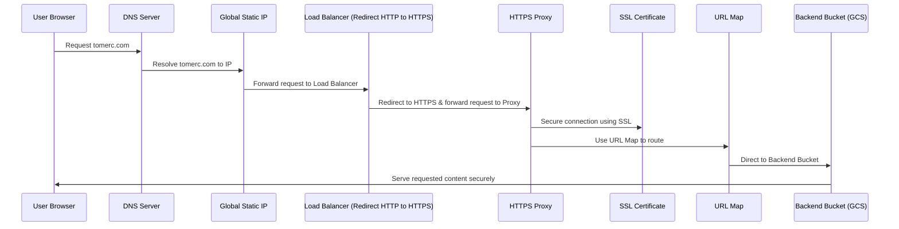

## My Cloud Resume Challenge Journey
### How I Learned Practical Cloud Skills in GCP with the Cloud Resume Challenge

As someone who loves to learn by doing, I was actively looking for ways to gain practical experience in cloud-related skills. 
Although I have prior experience as a developer who already used various technologies, I was genuinely amazed at how much I learned by taking this challenge.
In this post, I will share my journey of developing and implementing the challenge step-by-step.
It will be a combination of the things I learned along with the code/commands I used through the development process.

## Stage 0 - Introduction

> The "Cloud Resume Challenge" is an initiative that encourages individuals to showcase their skills in cloud computing by building and deploying a resume website on a cloud provider of their choice. 
> It provides an opportunity to demonstrate practical knowledge in areas such as infrastructure-as-code, serverless computing, and cloud services. 
> The participants can gain hands-on experience and enhance their understanding of cloud technologies while creating an impressive online resume.

After completing the challenge, the practitioner can gain multiple skills, related (but not limited) to the following:
- Web Development (Frontend / Backend)
- IaC (Infrastructure as Code) using Terraform
- CI/CD with GitHub Actions
- Serverless Architecture on GCP (Cloud Functions, API Gateway, Cloud Storage, Firestore and Cloud Run)
- Security (IAM, bucket policies)
- Networking (Cloud DNS, Cloud CDN, Routing/IP traffic, Load balancing)

### Prerequisites
I will **not** go through some of the prerequisites that are required for implementing the challenge:
- GCP account, GCP Service Account, Google Cloud billing account, Google Cloud SDK
- Installing Terraform and Python locally
- Obtaining domain name (can be obtained from Google Cloud Domains, GoDaddy, etc..)
- Enabling the required services and APIs in Google Cloud

With that in mind - let's start.

## Stage 1 - Creating the Front End
This section is about building the visual representation of the resume using just HTML, CSS and JavaScript.

### 1.1 HTML
The resume should be created using HTML. It doesn't have to be too fancy, because the challenge is not about responsive web design and ideal styling.\
I am not the best web designer, but I think I came up with something that looks really nice after a bit of learning and some trial and error.

### 1.2 CSS
The resume needs to be styled with CSS. So it will be something other than just a raw HTML. I used CSS to make the resume page responsive on mobile devices.
It wasn't too hard to figure out, but does require some learning.

### 1.3 Javascript
The resume should include a simple Javascript for counting the number of visitors and retrieving it from the database.\
I wrote a small javascript code to fetch the JSON content from the API endpoint on page load and update the HTML page with the current visitor count.

## Stage 2 - Hosting and Serving with Cloud Services

### 2.1 Cloud Storage
The static files (HTML, CSS, and JS) are stored in a private Google Cloud Storage bucket, and it's configured to provide the files when accessed from the CDN.

### 2.2 Cloud CDN
The resume page is served using CDN. For this, I decided to use Google's Cloud CDN.

### 2.3 Load Balancing
The website URL should use HTTPS for security. Any HTTP request is redirected to HTTPS using a Cloud Load Balancer. I used a Cloud Load Balancer for this.

### 2.4 SSL Certificate
I had to create a Google-managed SSL certificate to allow a secure connection between the server and the client. In this case - my resume website and the client who requests it.

### 2.5 DNS
Now, I had to configure the DNS, so I can point a custom DNS domain name to the load balancer endpoint, so my resume can be accessed at `tomerc.com` I used Google Cloud Domain to obtain this domain. 
Since the DNS zone is created automatically once obtaining the domain from Google Cloud Domain, I didn't have to create it myself.

### 2.6 Everything put together
I wrote a simple bash script that does everything automatically to help me with the deployment of the website.

```bash
#!/bin/bash  

export PROJECT_ID="cloud-resume-project-1234"  
export BUCKET_NAME="www.tomerc.com"  
export DOMAIN_NAME="tomerc.com"  
export HTML_PAGE="index.html"  
export RESERVATION_NAME="ip-reservation"  
export NEG_NAME="bucket-neg"  
export URL_MAP_NAME="url-map"  
export CERTIFICATE_NAME="ssl-cert"  
export TARGET_HTTPS_PROXY_NAME="https-proxy"  
export FORWARDING_RULE_NAME="https-forwarding-rule"  
export ZONE_NAME="tomerc-zone"  

GREEN='\033[0;32m'  
NC='\033[0m'  
  
echo -e "${GREEN}Setting the project...${NC}"  
gcloud config set project $PROJECT_ID  
  
echo -e "${GREEN}Creating backend bucket...${NC}"  
gsutil mb gs://$BUCKET_NAME  
  
echo -e "${GREEN}Copying HTML page to the bucket...${NC}"  
gsutil cp $HTML_PAGE gs://$BUCKET_NAME/  
  
echo -e "${GREEN}Setting the bucket's website configuration...${NC}"  
gsutil web set -m $HTML_PAGE gs://$BUCKET_NAME  
  
echo -e "${GREEN}Changing bucket IAM to allow all users view...${NC}"  
gsutil iam ch allUsers:objectViewer gs://$BUCKET_NAME  
  
echo -e "${GREEN}Creating IP reservation...${NC}"  
gcloud compute addresses create $RESERVATION_NAME --global  

echo -e "${GREEN}Creating backend bucket for Cloud CDN...${NC}"  
gcloud compute backend-buckets create $NEG_NAME --gcs-bucket-name=$BUCKET_NAME --enable-cdn  

echo -e "${GREEN}Creating URL map...${NC}"  
gcloud compute url-maps create $URL_MAP_NAME --default-backend-bucket=$NEG_NAME  

echo -e "${GREEN}Creating SSL certificate...${NC}"  
gcloud compute ssl-certificates create $CERTIFICATE_NAME --domains $DOMAIN_NAME  

echo -e "${GREEN}Creating target HTTPS proxy...${NC}"  
gcloud compute target-https-proxies create $TARGET_HTTPS_PROXY_NAME --ssl-certificates=$CERTIFICATE_NAME --url-map=$URL_MAP_NAME  
  
echo -e "${GREEN}Getting the IP address...${NC}"  
IP_ADDRESS=$(gcloud compute addresses describe $RESERVATION_NAME --global --format="get(address)")  

echo -e "${GREEN}Creating a DNS record set...${NC}"  
gcloud dns --project=$PROJECT_ID record-sets create $DOMAIN_NAME. --zone=$ZONE_NAME --type="A" --ttl="300" --rrdatas=$IP_ADDRESS  
  
echo -e "${GREEN}Creating forwarding rule...${NC}"  
gcloud compute forwarding-rules create $FORWARDING_RULE_NAME --global --target-https-proxy=$TARGET_HTTPS_PROXY_NAME --address=$IP_ADDRESS --ports=443
```

To sum this up:
1. A user makes a request to `tomerc.com`.
2. The request is sent to the DNS server.
3. The DNS server resolves `tomerc.com` to the IP address defined in the DNS A record (in this case, the global IP address reserved under the name `ip-reservation`).
4. The request is then sent to the HTTP(S) Load Balancer using this IP.
5. The HTTP(S) Load Balancer forwards the request to the appropriate target proxy (in this case, `https-proxy` for HTTPS traffic).
6. The target proxy uses the URL map (`url-map`) to route the traffic.
7. The URL map points to the backend bucket (`bucket-neg`) that serves the content.
8. The GCS Bucket associated with the backend bucket (`www.tomerc.com`) returns the requested content (`index.html`).
9. The content is served over HTTPS due to the SSL certificate (`ssl-cert`).


Here is a sequence diagram of how it will work when a user will request `tomerc.com`:


## Stage 3 - Building the API
In this section, I will explain how I created the API which will interact with the Firestore database.\
Since I didn't want to expose my cloud function publicly, so I used Cloud Endpoints together with Cloud Run to direct the requests to the cloud function.

### 3.1 Database
I used Firestore to save and retrieve the visitor count. Firestore is a NoSQL database which is perfect for this use case.\
I created a single record in a Firestore table, which gets constantly updated when a new visitor opens the page. There is no need for infra deployment here since  the database is automatically created by the cloud function when the first visitor visits the website.

### 3.2 Cloud Function
The function responsible for updating and returning overall visitors count is written in Python.\
It will first check if the collection `visitors` exists, in case it does not exist, it will create it and set the count to 1. If it's already exist, it will get the visitors count value, increase it by 1 and return it.

```python
from google.cloud import firestore


def increment_visitor_count(request):
	db = firestore.Client()
	collection_ref = db.collection('visitors')
	
	if not collection_ref.get():
		doc_ref = collection_ref.document('count')
		count = 1

	else:
		doc_ref = collection_ref.document('count')
		count_snapshot = doc_ref.get()
		count = count_snapshot.get('count') + 1

	new_count = {'count': count}
	doc_ref.set(new_count)
	return dict(new_count)
```

To deploy the function, I used the following command:

```bash
gcloud functions deploy increment_visitor_count \
  --runtime python310 \
  --trigger-http \
  --allow-unauthenticated
```

After deploying the function, I added the necessary role to the service account:

```bash
gcloud projects add-iam-policy-binding $PROJECT_ID \
--member=serviceAccount:$PROJECT_ID@appspot.gserviceaccount.com \
--role=roles/datastore.user
```

Once the function is deployed, I tested it by sending a GET request using cURL:

```curl
curl -m 70 -X GET https://us-central1-cloud-resume-project-1234.cloudfunctions.net/increment_visit_count \
-H "Authorization: bearer $(gcloud auth print-identity-token)"
```

And got the response from the function:

```
{"count":1}
```

### 3.3 Cloud Endpoints for Cloud Functions with ESPv2

I didn't want to expose the endpoint of the cloud function to the public, in order to prevent security risks, including:

1. **Unwanted Access:** Malicious users may attempt to gain access to your cloud function, potentially causing unauthorized actions or data breaches.
2. **Denial of Service (DoS):** Without proper security measures, an exposed endpoint can be hit with a large number of requests, potentially leading to a denial of service.
3. **Inappropriate Use of Resources:** If the cloud function is set to auto-scale based on the number of requests, exposing the endpoint could lead to unnecessary costs if the function is invoked frequently or abusively.

To achieve that, I choose to use Google Cloud Endpoints with Google Cloud Run, since they can help manage these potential security risks with features like rate limiting, request validation, etc..

### Cloud Run

To create the Cloud Run service, I used Flask to create a simple server which will forward HTTP requests and responses to the `increment_visitor_count` function:

```python
import os
import requests
from flask import Flask
from dotenv import load_dotenv

load_dotenv()

app = Flask(__name__)

@app.route('/', methods=['GET'])
def main():
    url = os.getenv("CLOUD_FUNCTION_URL")
    return requests.post(url).json


if __name__ == '__main__':
    app.run(host='0.0.0.0', port=8080)
```

Create a `requirements.txt` file:

```
flask
requests
python-dotenv
```

Next, I created a Docker file that will containerize the Flask app:

```dockerfile
FROM python:3.9-slim-buster

WORKDIR /

ADD . /

RUN pip install --no-cache-dir -r requirements.txt

EXPOSE 8080

ENV PORT 8080

CMD ["python", "main.py"]
```

Once done, I deployed the container to Cloud Run:

```
gcloud builds submit --tag gcr.io/$PROJECT_ID/my-proxy
gcloud run deploy --image gcr.io/$PROJECT_ID/my-proxy --platform managed
```

After deploying the image, I got a URL for the Cloud Run service:

```
ID                                    CREATE_TIME                DURATION  SOURCE                                                                                             IMAGES                                           STATUS
247708a4-c504-44ce-b2fd-dbdeb05e8fc4  2023-07-24T20:44:47+00:00  29S       gs://cloud-resume-project-1234_cloudbuild/source/1690231485.54005-84f0e487663c41a48e60bbc90caa6816.tgz  gcr.io/cloud-resume-project-1234/my-proxy (+1 more)  SUCCESS
Service name (my-proxy):
Allow unauthenticated invocations to [my-proxy] (y/N)?  y

Deploying container to Cloud Run service [my-proxy] in project [cloud-resume-project-1234] region [us-central1]
✓ Deploying new service... Done.
  ✓ Creating Revision...
  ✓ Routing traffic...
  ✓ Setting IAM Policy...
Done.
Service [my-proxy] revision [my-proxy-00001-haf] has been deployed and is serving 100 percent of traffic.
Service URL: https://my-proxy-kcory2ywjq-uc.a.run.app
```

#### Cloud Endpoints
Now, after the image for the cloud run service is deployed I had to create an API endpoint using Cloud Endpoints. To do it, I created an OpenAPI specification file for the API:

```yml
swagger: '2.0'
securityDefinitions:
    api_key:
        type: "apiKey"
        name: "key"
        in: "query"
info:
    title: Cloud Endpoints + GCF
    description: Sample API on Cloud Endpoints with a Google Cloud Functions backend
    version: 1.0.0
host: cr-proxy-kcory2ywjq-uc.a.run.app
schemes:
    - https
produces:
    - application/json
paths:
    /increment_visitor_count:
        get:
            summary: increment the visitor count
            operationId: increment
            x-google-backend:
                address: https://us-central1-cloud-resume-project-1234.cloudfunctions.net/increment_visitor_count
                protocol: h2
            responses:
                '200':
                    description: A successful response
                    schema:
                        type: string

```

And deployed it using:

```bash 
gcloud endpoints services deploy api.yaml \
    --project $PROJECT_ID
```

Once finished successfully, I got:

```
Operation finished successfully. The following command can describe the Operation details:
 gcloud endpoints operations describe operations/rollouts.my-proxy-kcory2ywjq-uc.a.run.app:2e82d5b8-ea30-40ea-89e3-e6b6f0eae468

Enabling service [my-proxy-kcory2ywjq-uc.a.run.app] on project [cloud-resume-project-1234]...
Operation "operations/acat.p2-351987396277-ec2cfc27-67e3-487c-a7bf-a892c2288f8a" finished successfully.

Service Configuration [2023-07-24r0] uploaded for service [my-proxy-kcory2ywjq-uc.a.run.app]

To manage your API, go to: https://console.cloud.google.com/endpoints/api/my-proxy-kcory2ywjq-uc.a.run.app/overview?project=cloud-resume-project-1234
```

Now, the cloud function can be triggered from https://my-proxy-kcory2ywjq-uc.a.run.app/increment

## Stage 4 - Backend & Frontend integration
This section is about embedding the value coming from Firestore through the Cloud Function to the JS code, making the page dynamically count and display the current visitors number.

### 4.1 Dynamic counter value
The script responsible for retrieving and updating the counter is found in the src/frontend/scripts/visitCounter.js file.\
It makes an HTTP POST request to the API Gateway endpoint in order to retrieve & update counter value on each DOM load.

```javascript
window.onload = function() {
    fetch('https://my-proxy-kcory2ywjq-uc.a.run.app/increment_visitor_count', {
        method: 'GET',
        headers: {
            'Content-Type': 'application/json'
        }
    })
    .then(response => response.json())
    .then(data => document.getElementById('counter').textContent = data.count)
    .catch(error => console.error('Error:', error));
};
```

## Stage 5- Automation & CI/CD

### 5.1 Infrastructure as Code (IaC)
The Google Cloud resources are defined and provisioned using Terraform, with definitions located in the `terraform` directory. 
The Terraform script will:

- Authenticate against Google Cloud using the service account key provided in gcp-key.json.
- Set the project, region, and zone for the resources to be provisioned.
- Create a Google Cloud Storage bucket to host a website, with its configuration being defined by variables.
- Upload specified website content to the storage bucket.
- Assign public access permissions to the storage bucket, allowing anyone to view its contents.
- Reserve a global IP address.
- Set up a backend bucket with the Cloud CDN enabled, pointing to the website bucket.
- Create a URL map that directs traffic to the backend bucket.
- Generate an SSL certificate for the provided domain.
- Establish an HTTPS proxy that uses the generated SSL certificate and the previously defined URL map.
- Set up a global forwarding rule that directs incoming HTTPS traffic on port 443 to the HTTPS proxy, utilizing the reserved IP address.

### 5.2 Tests
I wrote tests for the Cloud Run instance and Cloud Function, and for the UI using Playwright.\
Tests in CI/CD pipelines are vital to validate code changes automatically, ensuring software stability, reliability, and functionality.\
They help catch bugs early, before pushing new code to the repository,  and enable efficient, high-quality code delivery.

### 5.3 CI/CD - GitHub Actions
To make configuration changes, testing, and deployment faster, the deployment is not done manually, but rather executed automatically using GitHub Actions and a dedicated pipeline workflow.\
All steps and stages can be seen in .github/workflows/main.yaml file.\
The pipeline I created, is triggered when pushing new code to the repository's main branch.

## Pipeline Overview
The given pipeline is designed for automated configuration changes, testing, and deployment using GitHub Actions.
I have some previous experience with other CI/CD tools, but I was amazed by how simple yet powerful GitHub Actions is.

### 1. `setup`
Responsible for the setup required for the pipeline.

- **Checkout repository**: Pulls the latest code from the main branch.
- **Setup Google Cloud credentials**: Creates a JSON file using the secret service account key for subsequent steps.
- **Set up Cloud SDK**: Configures the Google Cloud SDK with the provided project ID and service account.
- **Archive gcp-key.json as an artifact**: Archives the key file for later use in other jobs.

### 2. `terraform`
Configures and deploys infrastructure using Terraform.

- **Setup Terraform**: Initializes Terraform with the desired version and credentials.
- **Terraform Init**: Prepares Terraform to deploy the defined infrastructure.
- **Terraform Apply**: Deploys infrastructure to Google Cloud using the provided key.

### 3. `unit-tests`
Executes unit tests for backend services.

- **Checkout repository**: Pulls the latest code from the main branch.
- **Set up Python**: Prepares the environment with Python 3.9.
- **Install Dependencies for Cloud Run**: Loads necessary dependencies for the Cloud Run backend service.
- **Run Cloud Run Tests**: Conducts integration tests for the Cloud Run service.
- **Install Dependencies for Cloud Function**: Loads required dependencies for the Cloud Function backend service.
- **Run Cloud Function Tests**: Executes main tests for the Cloud Function.

### 4. `build-and-deploy`
Compiles backend services and frontend, followed by deployment.

- **Checkout repository**: Pulls the latest code from the main branch.
- **Download gcp-key.json artifact**: Retrieves the GCP key for authentication purposes.
- **Deploy Cloud Function**: Activates the service account and releases the Cloud Function.
- **Build and Deploy Cloud Run Service**: Constructs the Docker container for Cloud Run and launches the service.
- **Deploy Frontend**: Pushes `index.html` of the frontend to a Google Cloud Storage bucket.

## Architecture Diagram


## Things I learned
This challenge was an excellent learning experience and I could write an entire blog post just on what I learned. But for now, I will try to keep this part concise.

- Cloud Functions are very powerful, cost-effective, and easy way to run your code without spinning up a VM or deal with server configuration.
- Terraform is an amazing tool to create and manage GCP infrastructure - tasks I initially tackled manually at the beginning of the article were simply automated using Terraform.
- Google Cloud's logging is an amazing tool to find issues in your resources. It allowed me to quickly diagnose problems and ensure the overall health of my deployments.
- Amongst other CI/CD tools I have used in the past, GitHub actions is amazingly simple yet powerful, and it allowed me to get a fully working CI/CD pipeline relatively fast.


## Final Thoughts
Working on this project presented both unexpected challenges and enlightening moments.
Some tasks I anticipated would take mere minutes extended much longer due to oversights, errors, or gaps in my knowledge.
If you're considering this challenge, expect some hurdles. Instead of avoiding these difficulties, embrace them; they will enhance your cloud skills. 
Overcoming these obstacles is where real growth happens, and in my view, that's the greatest reward from this challenge. 

Thank you for reading!

You can check out my [webpage](https://tomerc.com/) as well as my [GitHub repository](https://github.com/AcrobaticPanicc/cloud-resume-challenge). 
